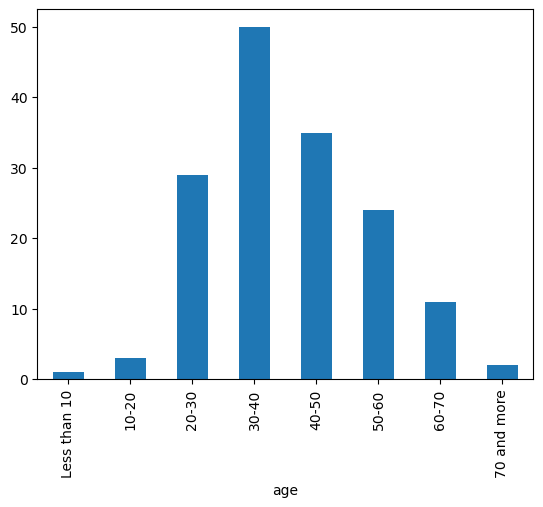
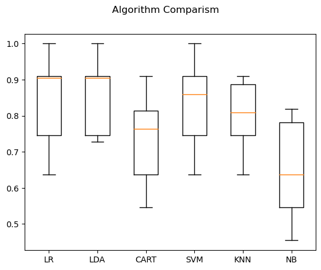
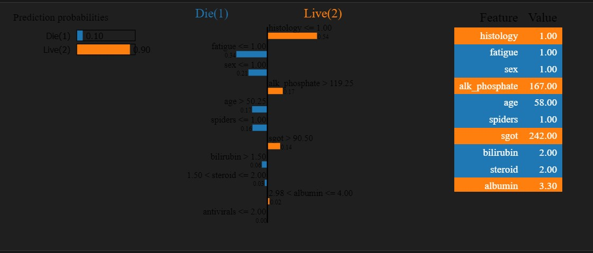
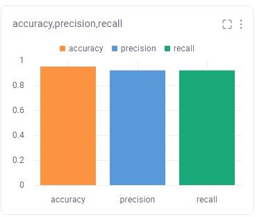
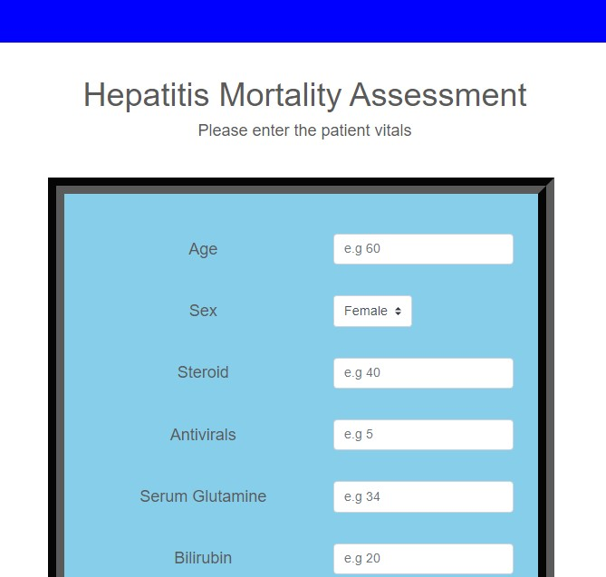
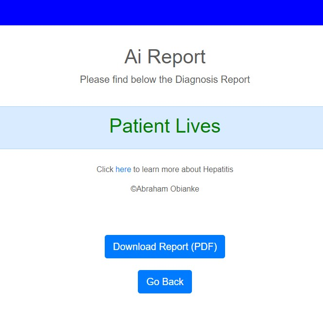
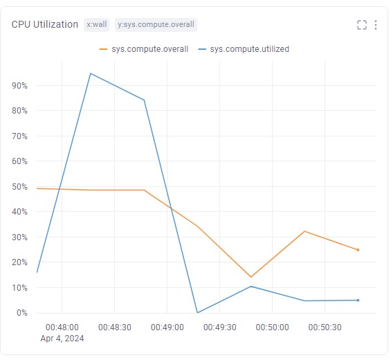

# Hepatitis Mortality Prediction using Machine Learning with Flask Web App -- Abraham Obianke 

## Introduction 
What is hepatitis?
Hepatitis is an inflammation of the liver. Inflammation is a swelling that happens when tissues of the body are injured or infected. It can damage your liver. This swelling and damage can affect how well your liver functions.

What causes hepatitis?
Hepatitis can be caused by excessive alcohol consumption, toxins, certain medications, and certain medical conditions.

*Source:https://medlineplus.gov/hepatitis.html*

## Business Problem 
### Problem Context
Patients with hepatitis have been continously increasing. An estimated 354 million people worldwide live with hepatitis B or C, and for most, testing and treatment remain beyond reach. Early detection is key to prioritizing and tailoring treatment plans for patients with low chances of survival from the disease.

*Source:https://who.int/health-topics/hepatitis#tab=tab_1*

## Objective(s)
- Predict if a patient having Hepatitis will live or die based on Machine Learning (ML) parameters 

## Dataset Information
     1. Class: DIE, LIVE
     2. AGE: 10, 20, 30, 40, 50, 60, 70, 80
     3. SEX: male, female
     4. STEROID: no, yes
     5. ANTIVIRALS: no, yes
     6. FATIGUE: no, yes
     7. MALAISE: no, yes
     8. ANOREXIA: no, yes
     9. LIVER BIG: no, yes
    10. LIVER FIRM: no, yes
    11. SPLEEN PALPABLE: no, yes
    12. SPIDERS: no, yes
    13. ASCITES: no, yes
    14. VARICES: no, yes
    15. BILIRUBIN: 0.39, 0.80, 1.20, 2.00, 3.00, 4.00
    16. ALK PHOSPHATE: 33, 80, 120, 160, 200, 250
    17. SGOT: 13, 100, 200, 300, 400, 500, 
    18. ALBUMIN: 2.1, 3.0, 3.8, 4.5, 5.0, 6.0
    19. PROTIME: 10, 20, 30, 40, 50, 60, 70, 80, 90
    20. HISTOLOGY: no, yes

    
*Data Source:* https://archive.ics.uci.edu/ml/machine-learning-databases/hepatitis/

## Mapping Business Problem to ML Problem

### Type of Machine Learning Problem
+ It is a binary classification problem, where given the above set of features, we need to predict if a given patient having hepatitis will live or die.

## Data Analysis Workflow
- Data Collection
- Importing Data
- Data Cleaning
  - Handling Missing Data
  - Outlier Detection and Removal
- Data Transformation
- Exploring Data using Descriptive Statistics
  - Understanding Data using
    - Univariate Analysis
    - Bivariate Analysis
    - Multivariate Analysis
- Understanding Data using Visualizations
    - Univariate
      - Histograms
      - Density Plot
    - Bivariate
      - Boxplot
    - Multivariate
      - Correlation Matrix

## Model Building 
+ Features Selection
+ Data Train/Test/Split
+ Algorithm Comparism
    - Logistic Regression (LR)
    - Linear Discriminant Analysis (LDA)
    - Decision Tree Classifier (CART)
    - Support Vector Machine (SVM)
    - K-Nearest Neighbor (KNN)
    - Naive Bayes (NB)
+ Serialize (Save Model)

## Model Interpretation
 + I implemented explainable AI techniques to understand the decisions made by the machine learning model for individual patients. With this technique, healthcare professionals can gain insights into which features are most influential in predicting the patient's outcome (i.e., survival or death). 

## Model Evaluation Metrics
Since this is a binary classification problem, I used the following metrics:
* **Confusion matrix** - For getting a better clarity of the number of correct/incorrect predictions made by the model.
* **Classification report** - For providing insights into the model's performance.
* **Accuracy score** - To evaluate the overall performance of the classification model.

## Business Solution 
  ### Deploying the Model with a Flask Web App
 + To make the model accessible to end-users, I have developed a user-friendly Flask web application called "Predio." The Flask web app, Predio, provides a friendly user interface where users can input relevant parameters through a web form. Upon submission, the app processes the input data using the accurately trained cloud based machine learning model and provides the predicted outcome (live or die). [Click HERE to Gain FREE Access to the Machine Learning Web App](http://abrahamoaks.pythonanywhere.com/) hosted in the cloud for global usage.

## Model Monitoring and Maintenance 
- I leveraged a robust cloud ML platform and implemented a quality control check, experiment tracking, and model monitoring techniques to observe data drift, conduct routine maintenance and prevent performance degradation. This is to help ensure model fairness, improve model performance and maintain model reliability.

### Key Achievement(s)
 + Model achieved an overall performance accuracy of >95% using Linear Discriminant Analysis (LDA) Machine Learning Algorithm.
 + Model operationalized and deployed on cloud premises for easy accessibility.
 + Model successfully logged for continuous monitoring and routine maintenance.
  
## Technologies Used
- Python 
- Coding Tools
   - VS Code
   - AWS Sagemaker
- ML Libraries 
  - Scikit-Learn
  - Pandas
  - Numpy
  - Matplotlib
  - Seaborn
  - Lime
  - Joblib
  - Comet ML
- Web App Frameworks 
  - Flask
  - Bootstrap 
  - HTML
  - CSS
  - JavaScript 

## Data Source
The dataset used in this project is sourced from the UCI Machine Learning Repository (https://archive.ics.uci.edu/ml/machine-learning-databases/hepatitis/).

## Conclusion
This project aims to provide insights into hepatitis mortality prediction using machine learning techniques. By analyzing relevant parameters, interpreting the outcome of the black-box model to foster trust and deploying the machine learning model with a user-friendly Flask web application, I aim to make the predictive model accessible to healthcare professionals and individuals interested in hepatitis prognosis aiding in early detection and preventive care.

## Contact
I'm Abraham Obianke, a Medic in Tech, for any enquiries, feedback or collaborations, feel free to [Connect with me on LinkedIn](https://www.linkedin.com/in/abraham-obianke-269112197?utm_source=share&utm_campaign=share_via&utm_content=profile&utm_medium=android_app) or send me an Email via  [abrahamoaks@gmail.com](mailto:your_email@example.com).

## References
1. University of California Irvine Machine Learning Repository (*https://archive.ics.uci.edu/ml/machine-learning-databases/hepatitis/*)
2. Medlineplus (*https://medlineplus.gov/hepatitis.html*)
3. World Health Organization (*https://who.int/health-topics/hepatitis#tab=tab_1*)
